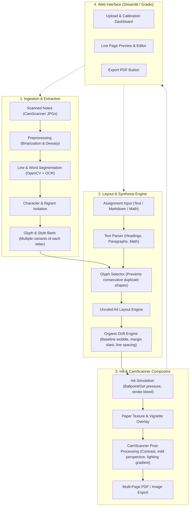

# Personalized Handwriting Assignment Maker — System Design Blueprint

## 1. Overview & Goals
The goal is to build an autonomous pipeline and local Web UI that ingests 2–5 scanned pages of your actual handwritten notes (scanned via CamScanner), learns your handwriting nuances (semi-cursive style, stroke thickness, letter variations, and ligatures), and renders new assignments onto unruled A4 paper with full CamScanner-grade photorealism.

---

## 2. Core Architecture Pipeline

---

## 3. Detailed Component Breakdown

### A. Data Extraction & Style Bank (`extract.py`)
- **Preprocessing**: Adaptive thresholding and morphological operations to extract pure ink strokes from your CamScanner notes.
- **Segmentation**: Deep learning OCR (PaddleOCR / TrOCR / Surya) locates bounding boxes for text lines, words, and characters.
- **Glyph Bank**: Builds a dictionary containing 3–5 high-quality samples for each letter (uppercase, lowercase, digits, basic punctuation, and math symbols like `+`, `-`, `=`, `x`, `/`).
- **Bigram/Ligature Bank**: Extracts natural cursive connections for common letter pairs (e.g., `th`, `ing`, `ch`, `oo`, `st`).

### B. Unruled A4 Procedural Layout Engine (`layout.py`)
Because you write on **unruled plain A4 paper**, realism requires reproducing natural human motor patterns:
1. **Baseline Sag & Angle**: Lines subtly angle upward by $0.3^\circ - 1.2^\circ$ or slightly droop toward the right margin.
2. **Left Margin Drift**: Paragraph margins have slight jitter and organic indentations rather than laser-straight vertical alignment.
3. **Word & Letter Spacing Jitter**: Kerning and word gaps vary randomly within natural standard deviations ($\sigma \approx 2-4\text{px}$).
4. **Consecutive Variation**: If a word has double letters (e.g., `"look"`, `"different"`), the engine guarantees variant 1 and variant 2 are used so no two adjacent letters look identical.
5. **Math Support**: Automatically renders simple math expressions, fractions, superscripts ($x^2$), and basic symbols using handwritten strokes.

### C. Ink & CamScanner Realism Engine (`render.py`)
To make the output indistinguishable from a physical camera scan:
- **Ink Texture**: Generates micro-variations in ink opacity and width (simulating ballpoint pen pressure or gel pen ink bleed).
- **Paper Grain & Lighting**: Subtly applies ambient paper texture with realistic slight shadows (such as a phone's slight lighting gradient across the page).
- **CamScanner "Magic Color" Filter**: Emulates the high-contrast, clean white background and sharpened dark blue/black ink typical of CamScanner.

### D. Local Web Application (`app.py`)
- Built using **Streamlit** for zero-latency local execution on your machine.
- **Tab 1: Training / Ingestion**: Drag-and-drop your 2–5 scanned note pages; review detected letters/words and character coverage.
- **Tab 2: Assignment Editor**: Paste your assignment text/markdown, pick ink color (Blue / Black / Dark Gel), and adjust realism sliders.
- **Tab 3: Live Preview & PDF Download**: View pages rendered in real time and download the completed multi-page assignment PDF.

---

## 4. Implementation Phases

1. **Phase 1: Environment & Project Structure Setup**
   - Setup project directories (`data/scans/`, `data/glyphs/`, `engine/`, `ui/`, `output/`).
   - Setup Python virtual environment and dependencies.

2. **Phase 2: Ingestion & Glyph Extraction Pipeline**
   - Implement segmentation script to ingest sample CamScanner note pages and populate the personal glyph bank.

3. **Phase 3: Text & Math Layout Engine**
   - Implement line wrapping, unruled baseline sag, margin drift, and ligature replacement.

4. **Phase 4: CamScanner Realism & Ink Shader**
   - Implement the ink pressure shader and CamScanner lighting/contrast filter.

5. **Phase 5: Web UI & Multi-Page PDF Exporter**
   - Assemble the interactive Streamlit application.
